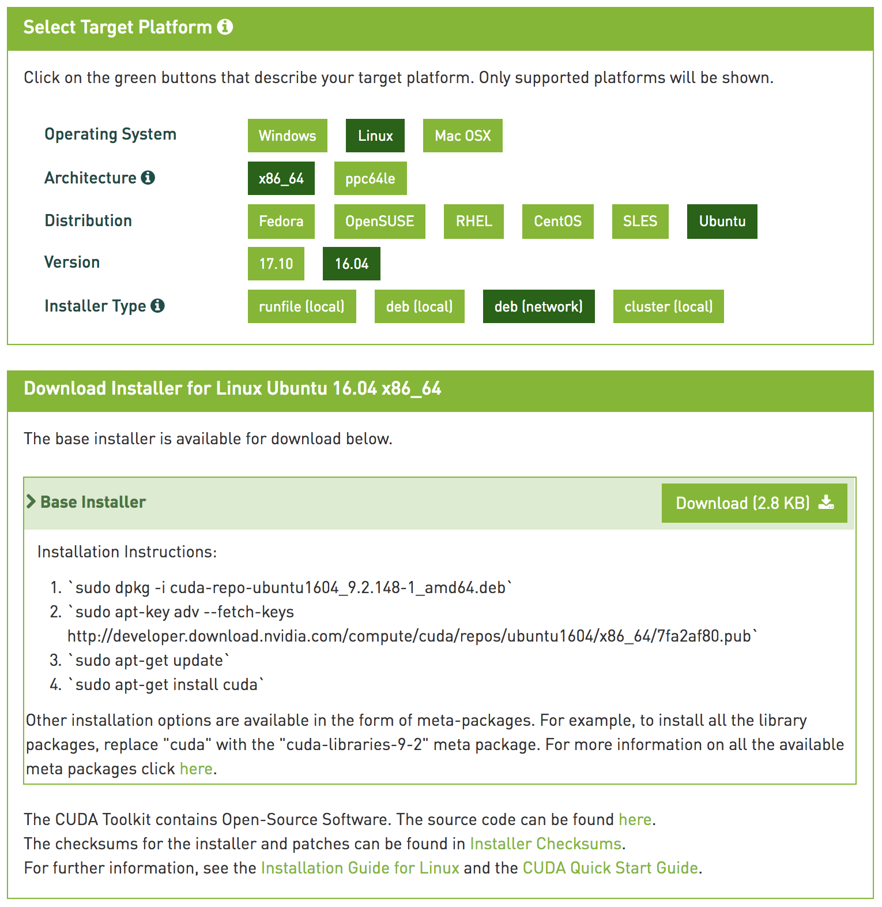
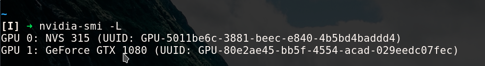

# NVIDIA

In hindsight I believe this [Hackernoon post](https://hackernoon.com/up-and-running-with-ubuntu-nvidia-cuda-cudnn-tensorflow-and-pytorch-a54ec2ec907d) is a very good starting point.


## Identify Graphic Card

Run this command to see what display cards are present
```bash
sudo lshw -C display
```

If the command above does not give useful data run this:
```bash
sudo update-pciids
```

... and then:
```bash
lspci -nn | grep '\[03'
```

## Install Drivers

[Websiteforstudents Guide](https://websiteforstudents.com/install-proprietary-nvidia-gpu-drivers-on-ubuntu-16-04-17-10-18-04/)

Add repository and update
```bash
sudo add-apt-repository ppa:graphics-drivers/ppa && sudo apt update
```

Install nvidia-\* (use tab to see choices)

```bash
sudo apt install nvidia-396-dev
```

Without -dev 
```bash
sudo apt install nvidia-396
```

```bash
sudo reboot
```

First time with the above settings I now have minimal resolution, and no displays in kde
display-settings. Same thing second time.

## Debug

Help:
* [set default gpu](https://askubuntu.com/questions/787030/setting-the-default-gpu)
* [Nvidia question](https://devtalk.nvidia.com/default/topic/1003017/how-do-i-set-one-gpu-for-display-and-the-other-two-gpus-for-cuda-computing-/)


Trying to change the xorg.conf settings 

```bash
sudo nvidia-xconfig  --enable-all-gpus
```

This generates a file at `/etc/X11/xorg.conf`

On ubuntu 16.04 create the file at `/usr/share/xorg.conf.d/xorg.conf`


Progress:
Read `/var/log/Xorg.0.log` and look for something going wrong.

In my case the log explicitly stated that the driver I installed (nvidia-396) does not
support one of my graphic cards (NVS 315). The log stated that the appropriate driver was
`nvidia-390.XX`

Changed installation to
```bash
sudo apt install nvidia-390
```

#### AND IT WORKS!

## Fixin

To reverse everything just run 
```bash
sudo apt purge "nvidia-*" 
```

and reboot
```bash
sudo reboot
```

## Cuda

[Cuda website](https://developer.nvidia.com/cuda-downloads?target_os=Linux&target_arch=x86_64&target_distro=Ubuntu&target_version=1604&target_type=debnetwork)

Trying with 



After which the screen is black with a prompt stating:

> The screen locker is broken and unlocking is not possible anymore.
> In order to unlock switch to a virtual terminal (e.g Ctrl+Alt+F2),
> log in and execute the command:
> 
> loginctl unlock-session 2
> 
> Afterwards switch back to the running session (Ctrl+Alt+F7).

After doing this I got back to kde.

:bulb:

After `sudo apt update` and reboot the resolution is messed up. The nvidia repo updated to
396.xx!

:bulb:

[Devtalk nvidia](https://devtalk.nvidia.com/default/topic/1028960/cuda-setup-and-installation/looking-for-cuda-compatibility-chart-for-nvidia-drivers/)

> Your 384.111 driver will work with CUDA 9.
>
> If you're following the NVIDIA install instructions with the nvidia deb using a deb install, then when you get to the point of:
>
> apt-get install cuda
>
> just do:
>
> apt-get install cuda-toolkit-9.0
>
> that will leave your 384.111 install alone.

Make sure that the correct version of nvidia-drivers is not updated by marking it as
"hold" ([apt-mark](https://www.computerhope.com/unix/apt-mark.html)):

```bash
sudo apt-mark hold nvidia-390
```

#### :bulb: nvidia-390 does not work with cuda-9.2 thus install cuda-9.0

Installation Instructions for cuda-9.2:
```bash
sudo dpkg -i cuda-repo-ubuntu1604_9.2.148-1_amd64.deb
sudo apt-key adv --fetch-keys http://developer.download.nvidia.com/compute/cuda/repos/ubuntu1604/x86_64/7fa2af80.pub
sudo apt-get update
sudo apt-get install cuda-toolkit-9.2
```

## Tested PyTorch
Installed PyTorch via conda using cuda 9.2

Then using IPython REPL 

```python
import torch
torch.cuda.is_available()
torch.cuda.current_device()
```

* torch.cuda.is_available() returns false.
* torch.cuda.current\_device() returns a statement saying that the nvidia-390 dirver is
  too old.

### :bulb: THUS uninstall cuda-9.2 and install cuda-9.0

```bash
sudo apt purge cuda-toolkit-9.2
sudo apt-get install cuda-toolkit-9.0
```

```bash
conda uninstall pytorch
conda uninstall cuda92
```

## Install cudnn
[Hackernoon post](https://hackernoon.com/up-and-running-with-ubuntu-nvidia-cuda-cudnn-tensorflow-and-pytorch-a54ec2ec907d)

Install all 3 files and run tests ackording to post

## Install gcc-6 g++-6
[askubuntu](https://askubuntu.com/questions/746369/how-can-i-install-and-use-gcc-6-on-xenial/746480)


## Set CUDA_VISIBLE_DEVICES

Use `nvidia-smi -L` list command to see the available GPU's. Notice which id you wich to
run computations on (in my case id=0) and set a variable:

```bash
export CUDA_VISIBLE_DEVICES=0
```



At work I had two graphics cards, one of which is too old for any computations and was
making it difficult to run gpu computations on pytorch and tensorflow.
