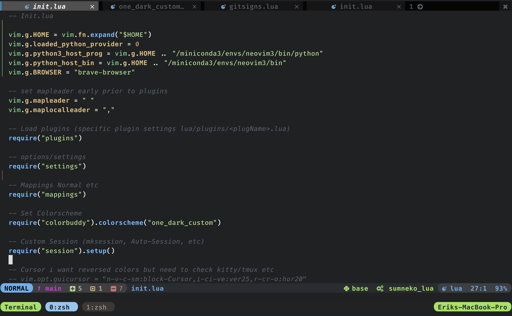

# NVIM



```bash
nvim
├── init.lua
├── README.md
├── after
│   └── ftplugin
│       ├── help.lua
│       ├── markdown.lua
│       └── python.lua
├── lua
│   ├── diagnostic.lua
│   ├── lsp.lua
│   ├── mappings.lua
│   ├── one_dark_custom.lua
│   ├── session.lua
│   ├── settings.lua
│   ├── tmux.lua
│   ├── treesitter_snippet.lua
│   ├── utils.lua
│   └── plugins
│       ├── ...
│       └── some_plugin_settings.lua
├── plugin
│   ├── fzf.vim
│   ├── packer_compiled.lua
│   └── session.vim
└── sessions
    ├── ...
    └── __Files_For_Saved_Sessions.vim
```


